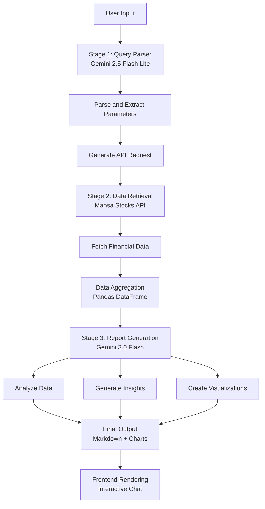

# Prometheus

A immersive chatbot using augmented generation techniques linked to the [Mansa's Stocks API](https://github.com/mansa-team/stocks-api) that generates in-depth, updated and trust-worthy data to help users manage their assets and investments, using an extensive workflow to generate responses using graphs, charts and etc.
With a full-on Chat History that can be integrated with the in-construction Mansa's main database and user data to provide the user a full chatbot experience inside our project that differs from just using normal chatbots like ChatGPT or Gemini, even tho the Large Language Model (LLM) used is Google's Gemini because of the use of exclusive and updated data on the Brazilian Stocks Market.

## Workflow

## TODO
- [ ] API integration for triggering the workflow
- [ ] Chat history system

## License
Mansa Team's MODIFIED GPL 3.0 License. See LICENSE for details.